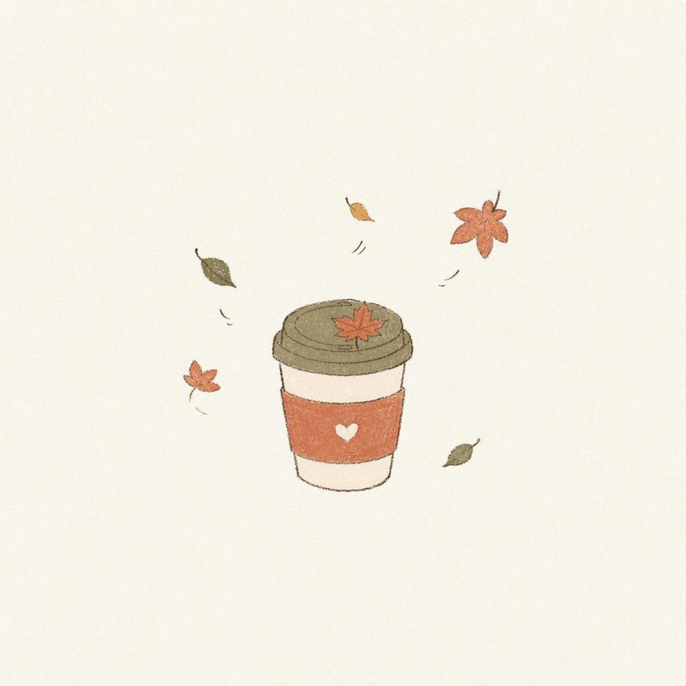

# naive-cream-illustration 🎨

> 拙趣奶油插画风格图片生成器 — 一个 OpenClaw AgentSkill

## 这是什么

一个 [OpenClaw](https://github.com/openclaw/openclaw) 的 AgentSkill，用于按固定的"拙趣奶油插画"视觉体系生成 1:1 方形插画。

用户提供任意主题（一句话、一个词、一个场景），skill 会自动：

1. 读取风格规范（配色、质感、排版、构图、禁用项）
2. 组装生图提示词
3. 调用图片生成工具出图
4. 生成后自检风格一致性

## 风格特点

- **纸白底 + 80%+ 大留白**：主体小而居中，四周透气
- **低饱和奶油系配色**：陶土红、橄榄绿、雾霾蓝、奶油黄、薄荷绿
- **稚拙手绘感**：铅笔草稿线、颤抖线条、平涂无光影、纸纹噪点
- **拙拙感手写排版**（可选）：圆润略歪的中文手写体，字距宽松
- **氛围**：松弛、治愈、日常、不费力

## 文件结构

```
naive-cream-illustration/
├── SKILL.md                        # Skill 主文件（触发规则、执行步骤、铁律）
├── references/
│   └── style-guide.md              # 完整风格指南（配色、质感、构图、排版、提示词模板）
├── samples/
│   └── autumn-milk-tea.jpg         # 示例图
└── README.md                       # 本文件
```

## 如何使用

### 前置条件

1. 安装 [OpenClaw](https://github.com/openclaw/openclaw)
2. 配置一个图片生成 skill（如 Allin Design、nano-banana 等）作为生图后端

### 安装

将本目录复制到 OpenClaw 的 skills 目录：

```bash
cp -r naive-cream-illustration ~/.openclaw/workspace/skills/
```

### 使用

在 OpenClaw 中直接对话触发：

```
画一张秋天的第一杯奶茶，喜茶风
用那个奶油插画风格画一只窗台晒太阳的猫
来一张治愈风插画，主题是周末市集，带文字"周末市集"
```

触发词包括：`喜茶风`、`奶油风`、`拙趣风`、`治愈插画`、`小红书那种感觉`、`我喜欢的风格`、`那套配色` 等。

## 可选参数

- **是否带文字**：默认不带；可指定文字内容
- **主点缀色倾向**：橄榄绿 / 陶土红 / 雾霾蓝 / 奶油黄 / 薄荷绿（默认根据主题自动匹配）
- **画幅**：固定 1:1 方形

## 风格灵感

本风格体系提炼自用户收藏的小红书参考图——喜茶"拙趣"品牌视觉 × [yomsweethome](https://www.xiaohongshu.com/user/profile/yomsweethome) 治愈系插画的共同视觉语言。

**不复制任何原图**：不出现喜茶 Logo、不临摹 yomsweethome 或其他任何具体画面/构图/角色。只应用风格规则。

## 示例

### 秋天的第一杯奶茶



> 配色：纸白底 + 陶土红 + 橄榄绿 + 炭黑轮廓

## License

MIT

## Contributing

欢迎提交 Issue 或 PR 来改进风格规范、添加新的点缀色系、或贡献示例图。
