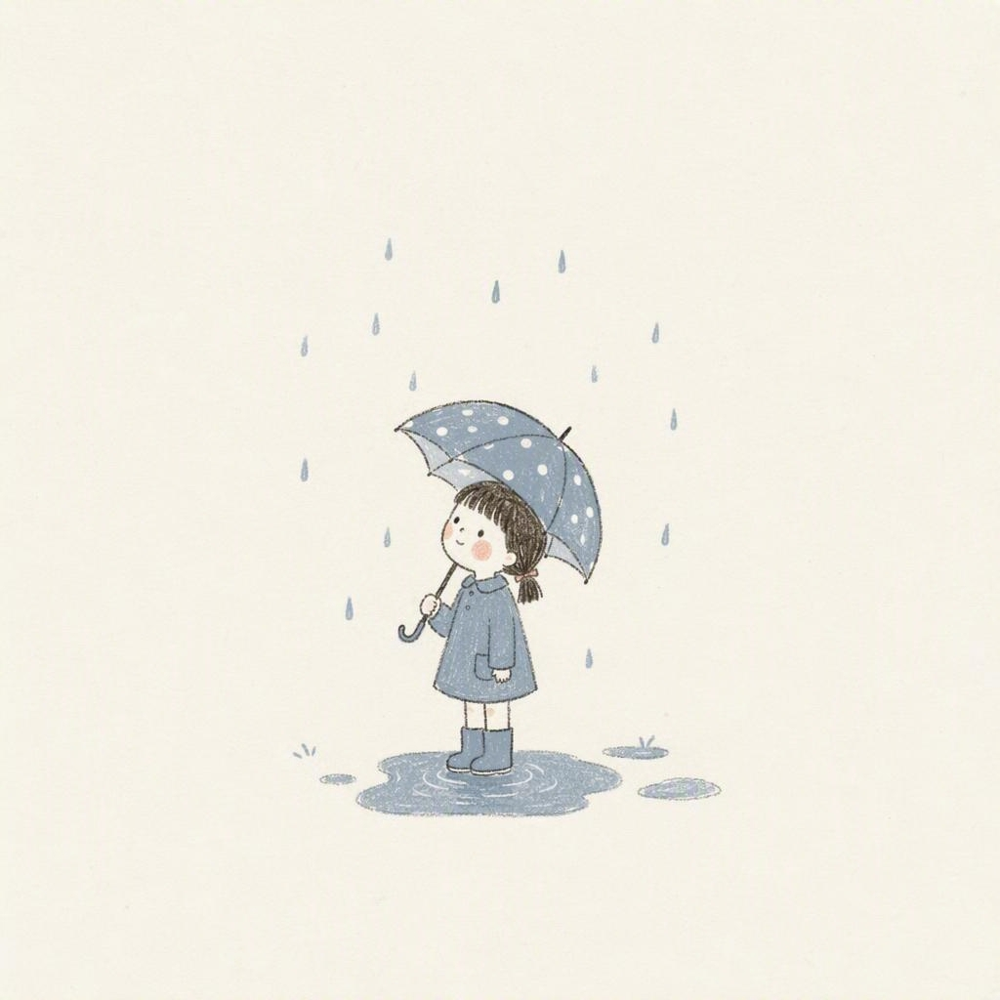

# naive-cream-illustration 🎨

> 拙趣奶油插画风格图片生成器 — 一个 OpenClaw AgentSkill

## 这是什么

一个 [OpenClaw](https://github.com/openclaw/openclaw) 的 AgentSkill，用于按固定的"拙趣奶油插画"视觉体系生成 1:1 方形插画。

用户提供任意主题（一句话、一个词、一个场景），skill 会自动：

1. 读取风格规范（配色、质感、排版、构图、禁用项）
2. 组装生图提示词
3. 调用图片生成工具出图
4. 生成后自检风格一致性

## 风格特点

- **纸白底 + 80%+ 大留白**：主体小而居中，四周透气
- **低饱和奶油系配色**：陶土红、橄榄绿、雾霾蓝、奶油黄、薄荷绿
- **稚拙手绘感**：铅笔草稿线、颤抖线条、平涂无光影、纸纹噪点
- **拙拙感手写排版**（可选）：圆润略歪的中文手写体，字距宽松
- **氛围**：松弛、治愈、日常、不费力

## 文件结构

```
naive-cream-illustration/
├── SKILL.md                        # Skill 主文件（触发规则、执行步骤、铁律）
├── references/
│   └── style-guide.md              # 完整风格指南（配色、质感、构图、排版、提示词模板）
├── samples/                        # 示例图
│   ├── autumn-milk-tea.jpg         # 陶土红 + 橄榄绿
│   ├── cat-on-windowsill.jpg       # 雾霾蓝
│   ├── weekend-market.jpg          # 橄榄绿 + 奶油黄 + 文字
│   ├── morning-coffee.jpg          # 奶油黄
│   └── girl-with-umbrella.jpg      # 雾霾蓝
├── README.md                       # 本文件
├── README_EN.md                    # 英文说明
└── LICENSE                         # MIT
```

## 快速开始

### 第一步：安装 OpenClaw

如果还没有 OpenClaw，先安装：

```bash
# macOS
brew install openclaw

# 或通过 npm
npm install -g openclaw
```

安装后初始化工作空间：

```bash
openclaw init
```

这会在 `~/.openclaw/workspace/` 下创建工作目录，其中包含 `skills/` 子目录。

### 第二步：安装本 Skill

```bash
cd ~/.openclaw/workspace/skills
git clone https://github.com/chensn05/photo-skill.git naive-cream-illustration
```

### 第三步：配置图片生成后端

本 Skill 负责风格规范和提示词组装，需要一个图片生成工具来真正出图。请选择以下一种方式配置：

#### 方式 A：Allin Design（小红书内部用户推荐）

小红书内部用户推荐使用 [Allin Design](https://allin.xiaohongshu.com) 作为生图后端：

```bash
cd ~/.openclaw/workspace/skills
# 安装 allin-design-image-generate skill（从内部 skill 仓库）
# 按内部文档配置 SSO cookie 和 qstoken
cd allin-design-image-generate
bash ./run.sh setup
```

配置完成后，本 skill 会通过 `bash ./run.sh generate` 调用 Allin Design 出图。

#### 方式 B：其他图片生成后端

如果你不是小红书内部用户，可以使用任何兼容的图片生成工具：

1. 安装你选择的图片生成 skill 到 `~/.openclaw/workspace/skills/` 目录下
2. 确保它支持通过命令行调用（如 `bash ./run.sh generate --prompt "..." --output "..."`）
3. 如果调用方式不同，修改本 skill 的 `SKILL.md` 第 4 步中的调用命令即可

> 💡 常见的外部图片生成工具：DALL-E API、Stable Diffusion WebUI、Midjourney API 等。只要能用命令行传入 prompt 并输出图片文件即可适配。

#### 方式 C：手动使用提示词

如果你不想配置自动生图，也可以直接用本 skill 的风格规范来手动生成：

1. 打开 `references/style-guide.md`，找到"提示词模板"部分
2. 按模板组装提示词（主题 + 风格块 + 文字要求）
3. 复制到任意 AI 生图工具（如 Midjourney、DALL-E、ChatGPT 等）使用

### 第四步：开始生图

在 OpenClaw 中直接对话触发：

```
画一张秋天的第一杯奶茶，喜茶风
用那个奶油插画风格画一只窗台晒太阳的猫
来一张治愈风插画，主题是周末市集，带文字"周末市集"
画一杯早晨的咖啡，拙趣风
画一张下雨天打伞的小女孩
```

触发词包括：`喜茶风`、`奶油风`、`拙趣风`、`治愈插画`、`小红书那种感觉`、`我喜欢的风格`、`那套配色` 等。

## 可选参数

| 参数 | 默认值 | 可选值 |
|------|--------|--------|
| 是否带文字 | 不带 | 可指定文字内容 |
| 主点缀色 | 自动匹配主题 | 橄榄绿 / 陶土红 / 雾霾蓝 / 奶油黄 / 薄荷绿 |
| 画幅 | 1:1 方形 | 固定，不可改 |

## 风格灵感

本风格体系提炼自用户收藏的小红书参考图——喜茶"拙趣"品牌视觉 × [yomsweethome](https://www.xiaohongshu.com/user/profile/yomsweethome) 治愈系插画的共同视觉语言。

**不复制任何原图**：不出现喜茶 Logo、不临摹 yomsweethome 或其他任何具体画面/构图/角色。只应用风格规则。

## 示例图

### 秋天的第一杯奶茶

> 配色：纸白底 + 陶土红 + 橄榄绿 + 炭黑轮廓

### 窗台晒太阳的猫

> 配色：纸白底 + 雾霾蓝 + 炭黑轮廓

### 周末市集（带文字）

> 配色：纸白底 + 橄榄绿 + 奶油黄 + 炭黑文字

### 早晨咖啡

> 配色：纸白底 + 奶油黄 + 炭黑轮廓

### 下雨天打伞的小女孩

> 配色：纸白底 + 雾霾蓝 + 炭黑轮廓

## License

MIT — 详见 [LICENSE](LICENSE)

## Contributing

欢迎提交 Issue 或 PR 来：
- 改进风格规范
- 添加新的点缀色系
- 贡献更多示例图
- 适配更多图片生成后端
