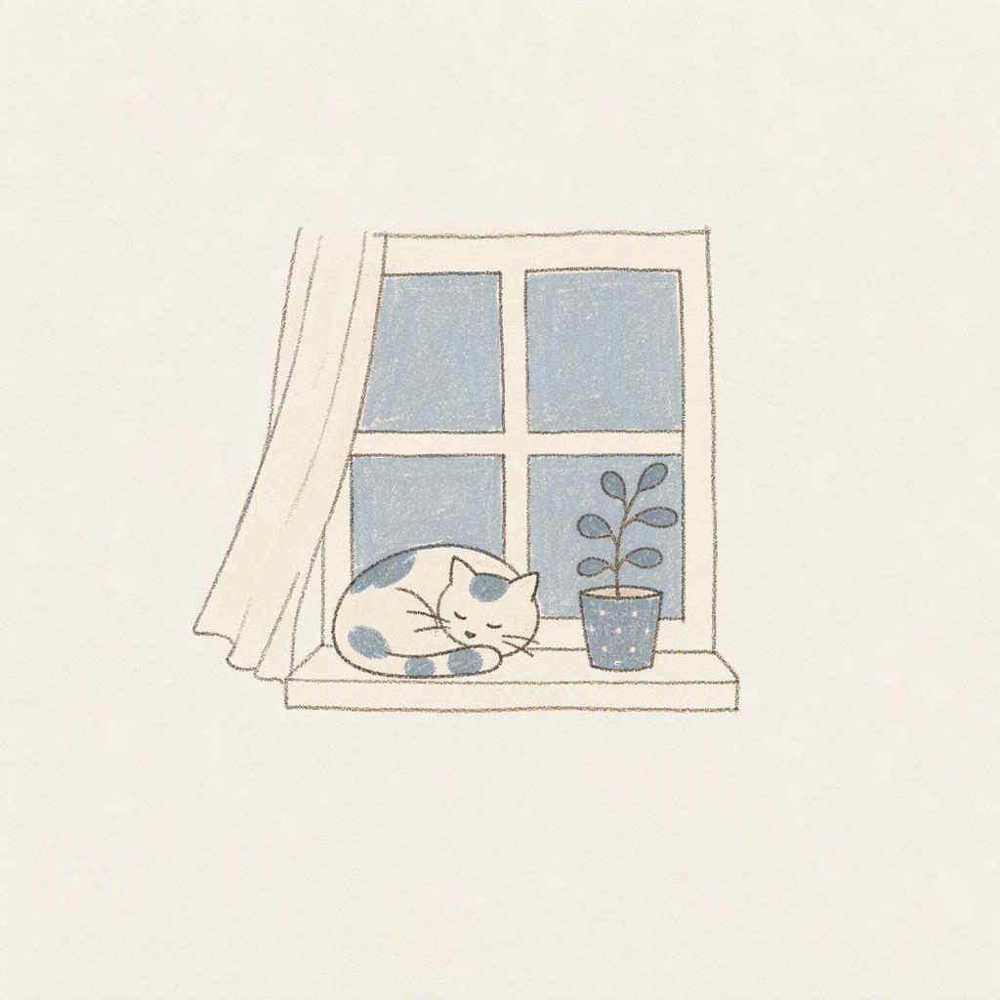
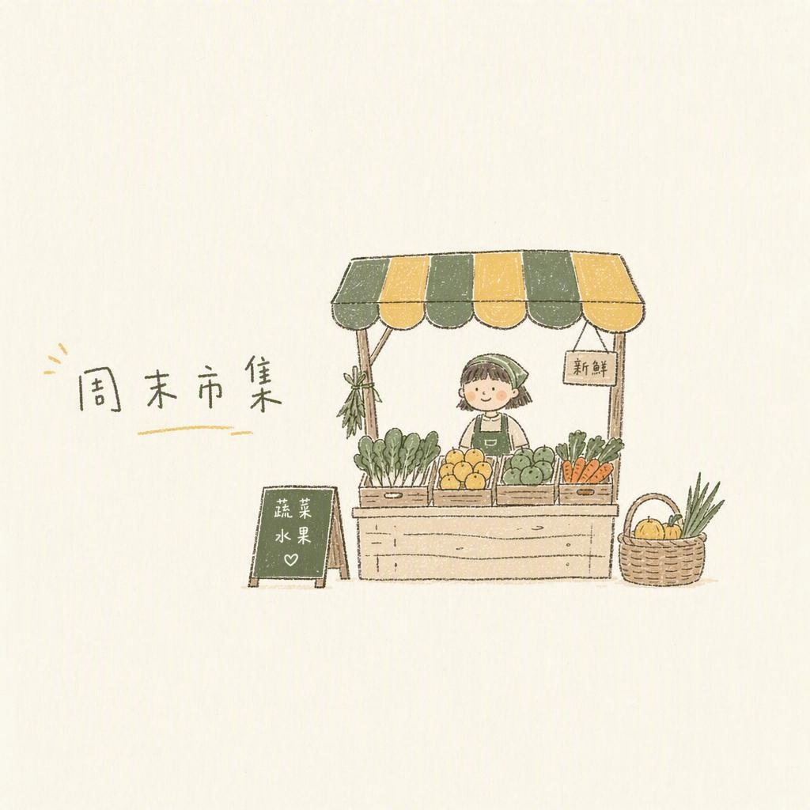
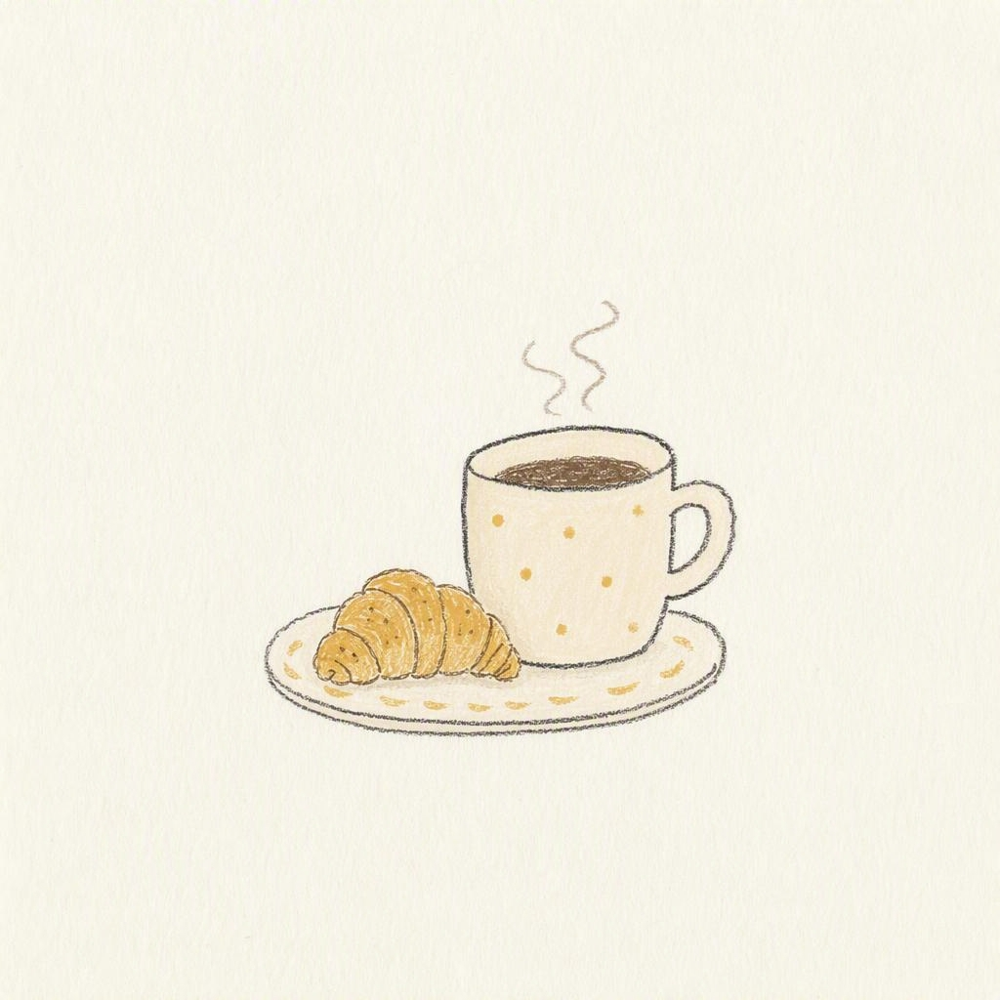

# naive-cream-illustration 🎨

> A naive, cream-toned illustration style generator — an OpenClaw AgentSkill

## What is this?

An [OpenClaw](https://github.com/openclaw/openclaw) AgentSkill that generates 1:1 square illustrations following a fixed "naive cream" visual system.

Provide any topic (a word, a sentence, a scene), and the skill will automatically:

1. Load the style specification (palette, texture, typography, composition, restrictions)
2. Assemble an image generation prompt
3. Call the image generation tool
4. Self-check style consistency after generation

## Style Features

- **Paper-white background + 80%+ whitespace**: Small centered subject, lots of breathing room
- **Low-saturation cream palette**: Terracotta red, olive green, hazy blue, cream yellow, mint green
- **Naive hand-drawn feel**: Pencil sketch lines, wobbly strokes, flat colors, paper grain texture
- **Childlike handwriting** (optional): Slightly wobbly Chinese text with loose letter-spacing
- **Mood**: Relaxed, healing, everyday, effortless

## File Structure

```
naive-cream-illustration/
├── SKILL.md                        # Skill entry (trigger rules, execution steps, constraints)
├── references/
│   └── style-guide.md              # Full style guide (palette, texture, layout, prompt template)
├── samples/                        # Example images
├── README.md                       # This file
├── README_CN.md                    # Chinese README
└── LICENSE                         # MIT
```

## How to Use

### Prerequisites

1. Install [OpenClaw](https://github.com/openclaw/openclaw)
2. Configure an image generation skill (e.g., Allin Design, nano-banana, etc.) as the backend

### Installation

Copy this directory into your OpenClaw skills folder:

```bash
git clone https://github.com/chensn05/photo-skill.git
cp -r photo-skill ~/.openclaw/workspace/skills/naive-cream-illustration
```

### Usage

Talk to OpenClaw naturally:

```
画一张秋天的第一杯奶茶，喜茶风
Draw a cat sunbathing on a windowsill, cream illustration style
来一张治愈风插画，主题是周末市集，带文字"周末市集"
```

Trigger words: `喜茶风`, `奶油风`, `拙趣风`, `治愈插画`, `小红书那种感觉`, `cream illustration`, `naive cream style`, etc.

## Optional Parameters

- **With/without text**: Default no text; can specify text content
- **Accent color**: Olive green / Terracotta red / Hazy blue / Cream yellow / Mint green (auto-matched by default)
- **Aspect ratio**: Fixed 1:1 square

## Style Inspiration

This style system is derived from the shared visual language of user-curated Xiaohongshu (RED) reference images — Heytea "拙趣" brand visual × yomsweethome healing illustrations.

**No original artworks are copied**: No Heytea Logo, no tracing of yomsweethome or any other specific artwork/composition/character. Only style rules are applied.

## Samples

### Autumn Milk Tea

> Palette: Paper-white + Terracotta red + Olive green + Charcoal outline

### Cat on Windowsill

> Palette: Paper-white + Hazy blue + Charcoal outline

### Weekend Market

> Palette: Paper-white + Olive green + Cream yellow + Charcoal outline with text

### Morning Coffee

> Palette: Paper-white + Cream yellow + Charcoal outline

## License

MIT — see [LICENSE](LICENSE)

## Contributing

Feel free to open Issues or PRs to improve the style guide, add new accent palettes, or contribute sample images.
