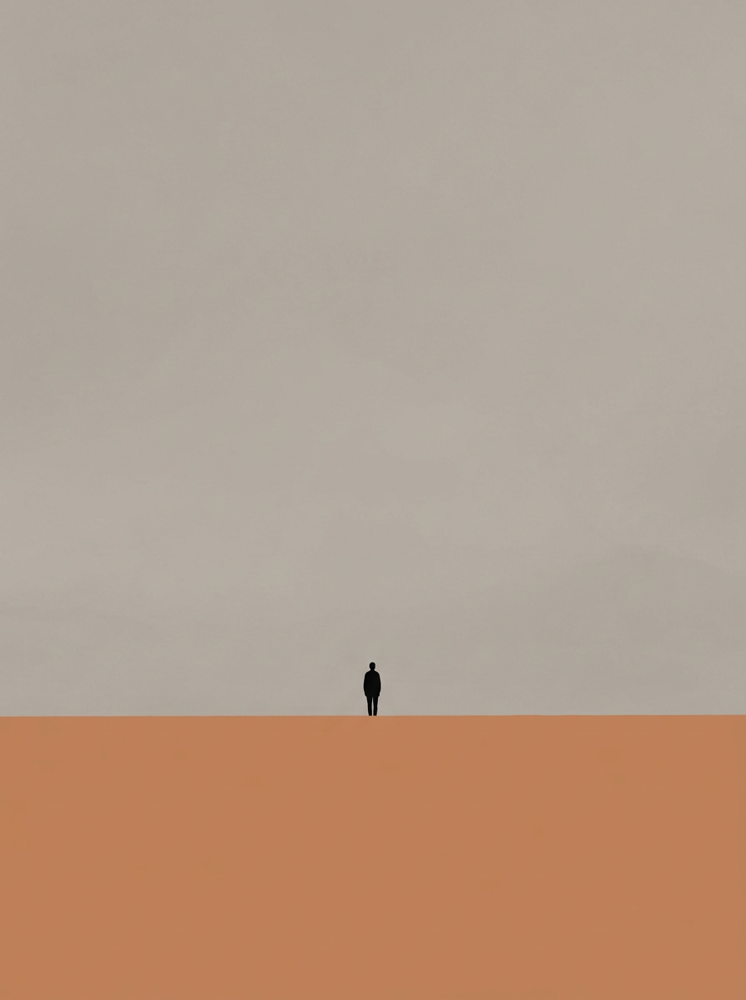

# minimalist-healing-art 🏔️

> 极简治愈风景插画风格生成器 — 一个 OpenClaw AgentSkill

## 这是什么

一个 [OpenClaw](https://github.com/openclaw/openclaw) 的 AgentSkill，用于按固定的"极简治愈风景"视觉体系生成 3:4 竖版插画。

用户提供任意主题，skill 会自动：

1. 读取风格规范（配色、质感、构图、人物规范、氛围）
2. 组装生图提示词
3. 调用图片生成工具出图
4. 生成后自检风格一致性

## 风格特点

- **极致留白 70%+**：画面大部分为空旷背景，主体小而偏侧
- **低饱和雾感色块**：2-3 个大色块分割画面，莫兰迪色系，高级克制
- **平涂无光影**：色块柔和过渡，无写实光影、无渐变、无体积感
- **微缩人影**：人物极小（5-10% 画面高度），背影/侧影，无五官，纯剪影
- **安静疏离氛围**：孤独但自洽，松弛但不空洞

## 文件结构

```
minimalist-healing-art/
├── SKILL.md                        # Skill 主文件（触发规则、执行步骤、铁律）
├── references/
│   └── style-guide.md              # 完整风格指南（配色、质感、构图、人物、提示词模板）
├── samples/
│   └── seaside-dusk.png            # 示例图
└── README.md                       # 本文件
```

## 如何使用

### 前置条件

1. 安装 [OpenClaw](https://github.com/openclaw/openclaw)
2. 配置一个图片生成 skill（如 Allin Design、nano-banana 等）作为生图后端

### 安装

```bash
cd ~/.openclaw/workspace/skills
git clone https://github.com/chensn05/photo-skill.git
cp -r photo-skill/minimalist-healing-art .
```

### 使用

在 OpenClaw 中直接对话触发：

```
画一张雪原独行，冷雾蓝色系，极简风景
画一张山野间的黄昏，陶土橙
画一张窗台边的猫，暖灰色系
画一个人的海边黄昏，治愈风
```

触发词包括：`极简风景`、`治愈风`、`空旷感`、`孤独美学`、`留白插画`、`色块风景`、`Guim Tió 风格`、`ohio 风格`、`旷野感`、`松弛感插画` 等。

## 可选参数

| 参数 | 默认值 | 可选值 |
|------|--------|--------|
| 是否带文字 | 不带 | 可指定文字内容 |
| 主色调 | 自动匹配主题 | 暖灰 / 冷雾蓝 / 陶土橙 / 苔藓绿 / 雾紫 / 暗夜蓝 |
| 画幅 | 3:4 竖版 | 固定，不可改 |

## 风格灵感

本风格体系提炼自两位艺术家的共同视觉语言：

- **ohio_ooooo**（韩国独立插画师）：低饱和奶油哑光色调、松弛柔和线条、独居日常碎片、朦胧温润
- **Guim Tió Zarraluki**（西班牙当代艺术家）：极致留白、大块平涂、微缩人影、雾感柔和色调

**不复制任何原图**：不临摹两位艺术家的任何具体画面/构图/角色。只应用风格规则。

## 示例图

### 海边黄昏

> 配色：陶土橙 + 暖灰 + 炭黑剪影

## License

MIT

## Contributing

欢迎提交 Issue 或 PR 来改进风格规范、添加新的色系、或贡献示例图。
